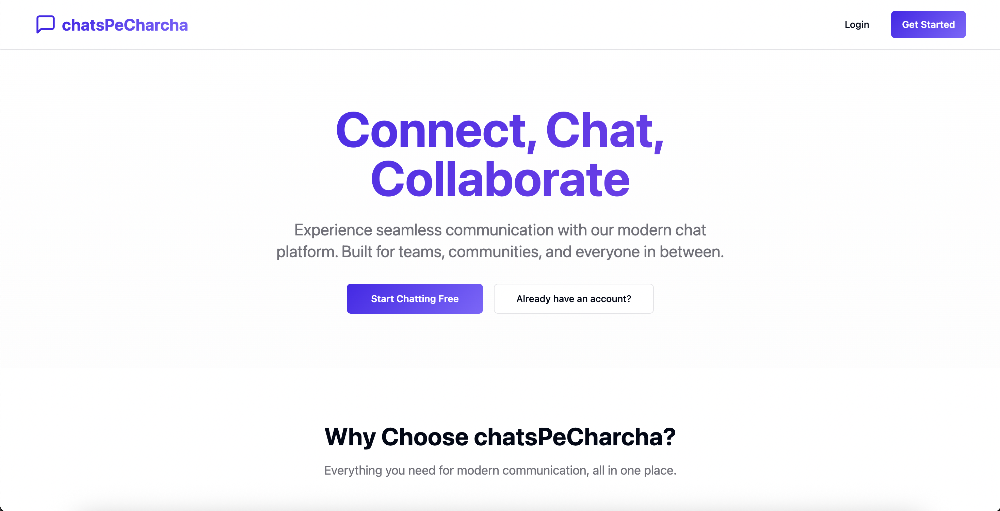

# ChatsPeCharcha

A modern, real-time chat application built with React, Node.js, and WebSockets. Connect with friends, join group chats, and stay connected with an intuitive user interface.



## ✨ Features

- 🔐 User Authentication (Signup/Login)
- 💬 Real-time messaging
- 👥 Group chats
- 📱 Responsive design
- 🎨 Modern UI with dark/light mode
- 🔔 Real-time notifications
- 📱 Mobile-friendly interface

## 🚀 Tech Stack

### Frontend
- React.js with TypeScript
- Vite.js for fast development
- Tailwind CSS for styling
- Shadcn UI components
- Socket.io for real-time communication
- React Query for data fetching

### Backend
- Node.js with Express
- MongoDB with Mongoose
- JWT for authentication
- Socket.io for real-time features
- Nodemailer for email services

## 🛠️ Getting Started

### Prerequisites

- Node.js (v18 or higher)
- npm or yarn
- MongoDB (local or cloud)

### Installation

1. **Clone the repository**
   ```bash
   git clone https://github.com/jatinpanday/chatsPeCharcha.git
   cd chatsPeCharcha
   ```

2. **Set up the backend**
   ```bash
   cd backend
   npm install
   cp .env.example .env
   # Update .env with your configuration
   ```

3. **Set up the frontend**
   ```bash
   cd ../frontend
   npm install
   cp .env.example .env
   # Update .env with your configuration
   ```

4. **Start the development servers**

   In the backend directory:
   ```bash
   npm run dev
   ```

   In the frontend directory:
   ```bash
   npm run dev
   ```

5. Open [http://localhost:5173](http://localhost:5173) in your browser.

## 📂 Project Structure

```
chatsPeCharcha/
├── backend/               # Backend server
│   ├── src/
│   │   ├── controllers/   # Route controllers
│   │   ├── models/        # Database models
│   │   ├── routes/        # API routes
│   │   ├── services/      # Business logic
│   │   └── index.js       # Server entry point
│   └── .env.example       # Environment variables example
│
└── frontend/              # Frontend React app
    ├── src/
    │   ├── components/    # Reusable UI components
    │   ├── pages/         # Page components
    │   ├── hooks/         # Custom React hooks
    │   └── lib/           # Utility functions
    └── public/            # Static files
```

## 🌟 Contributing

Contributions are welcome! Please follow these steps:

1. Fork the repository
2. Create your feature branch (`git checkout -b feature/AmazingFeature`)
3. Commit your changes (`git commit -m 'Add some AmazingFeature'`)
4. Push to the branch (`git push origin feature/AmazingFeature`)
5. Open a Pull Request

## 📄 License

This project is licensed under the MIT License - see the [LICENSE](LICENSE) file for details.

## 🙏 Acknowledgments

- [Shadcn UI](https://ui.shadcn.com/) for the beautiful components
- [Vite](https://vitejs.dev/) for the amazing developer experience
- [Socket.io](https://socket.io/) for real-time communication